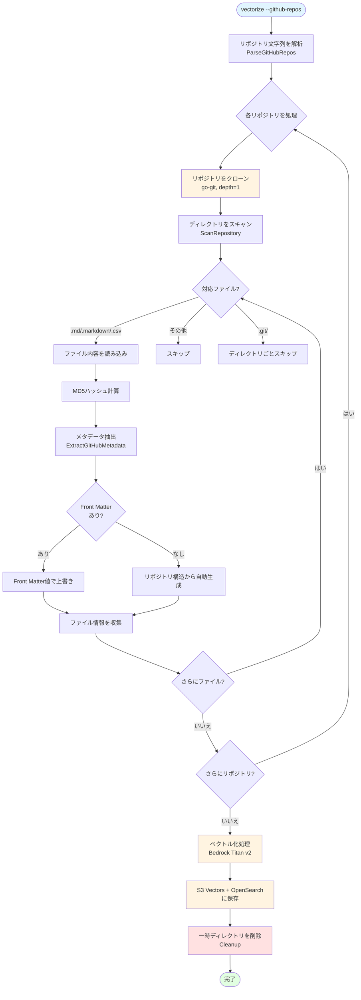
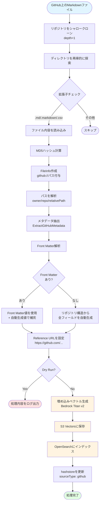

# GitHub データソース詳細解説

## 概要

RAGent の GitHub データソース機能は、GitHub リポジトリから直接 Markdown/CSV ファイルをクローンし、ベクトル化パイプラインに統合する機能です。ローカルファイルや S3 バケットに加えて、GitHub リポジトリを第三のデータソースとして利用できます。

この機能により、以下のユースケースが実現できます：

- **社内ドキュメントの一元検索**: GitHub 上の技術ドキュメント、Wiki、設計書をベクトル化し、RAG 検索の対象に含める
- **複数リポジトリの横断検索**: 組織内の複数リポジトリのドキュメントを統合的に検索可能にする
- **自動メタデータ生成**: リポジトリ構造（オーナー名、リポジトリ名、ディレクトリ構造）からメタデータを自動生成

## 全体の処理フロー



## 認証

### パブリックリポジトリ

パブリックリポジトリの場合、認証トークンは不要です。`--github-repos` フラグにリポジトリを指定するだけでクローンできます。

```bash
# パブリックリポジトリ（トークン不要）
RAGent vectorize --github-repos "owner/public-repo"
```

### プライベートリポジトリ

プライベートリポジトリにアクセスするには、`GITHUB_TOKEN` 環境変数を設定する必要があります。

```bash
# .env ファイルに設定
GITHUB_TOKEN=ghp_your_github_personal_access_token
```

**トークンの種類:**
- **Personal Access Token (classic)**: `repo` スコープが必要
- **Fine-grained Personal Access Token**: 対象リポジトリへの `Contents` 読み取り権限が必要

**認証の仕組み:**

内部的には、go-git の HTTPS クローン時に HTTP Basic 認証を使用します：

```go
cloneOpts.Auth = &http.BasicAuth{
    Username: "x-access-token",
    Password: token,  // GITHUB_TOKEN の値
}
```

`x-access-token` は GitHub が推奨する Personal Access Token 用のユーザー名です。

## パススキーム

GitHub からクローンしたファイルには、独自のパススキーム `github://` が付与されます。

### フォーマット

```
github://{owner}/{repo}/{relative_path}
```

**例:**
```
github://ca-srg/ragent/doc/vectorize.md
github://myorg/docs/guides/setup.md
github://myorg/docs/README.md
```

### パスの役割

| 用途 | 説明 |
|------|------|
| ベクトルキー | S3 Vectors に保存する際のキーとして使用 |
| ソース識別 | ローカルファイル・S3 ファイルと区別するための識別子 |
| 変更検出 | hashstore でソースタイプ `"github"` として管理 |
| メタデータ生成 | パスからオーナー名・リポジトリ名・相対パスを抽出 |

### パスの解析

内部では `parseGitHubPath` 関数がパスを分解します：

```go
// github://ca-srg/ragent/doc/vectorize.md の場合
// → owner: "ca-srg"
// → repo: "ragent"
// → relativePath: "doc/vectorize.md"
```

## メタデータ自動生成

GitHub データソースの大きな特徴は、リポジトリ構造からメタデータを自動生成する機能です。Front Matter が存在する場合はその値が優先されます。

### メタデータフィールドと生成ルール

| フィールド | Front Matter あり | Front Matter なし（自動生成） |
|-----------|------------------|---------------------------|
| **Title** | `title` フィールドの値 | 最初の H1 見出し、またはファイル名 |
| **Category** | `category` フィールドの値 | 親ディレクトリ名（ルートの場合は `"general"`） |
| **Author** | `author` フィールドの値 | リポジトリオーナー名 |
| **Source** | `source` フィールドの値 | リポジトリ名 |
| **Reference** | ― （常に自動生成） | `https://github.com/{owner}/{repo}/blob/main/{path}` |
| **Tags** | `tags` フィールドの値 | `[owner, repo]` |
| **CreatedAt** | `created_at` フィールドの値 | ― |
| **UpdatedAt** | `updated_at` フィールドの値 | ― |
| **WordCount** | ― （常に自動計算） | 本文の単語数 |

### 自動生成の例

**リポジトリ構造:**
```
myorg/docs/
├── guides/
│   └── setup.md
├── api/
│   └── reference.md
└── README.md
```

**`guides/setup.md`（Front Matter なし）の場合:**
```go
DocumentMetadata{
    Title:     "セットアップガイド",     // 最初のH1見出しから
    Category:  "guides",               // 親ディレクトリ名
    Author:    "myorg",                // リポジトリオーナー
    Source:    "docs",                 // リポジトリ名
    Reference: "https://github.com/myorg/docs/blob/main/guides/setup.md",
    Tags:      ["myorg", "docs"],      // [owner, repo]
}
```

**`README.md`（ルートレベル）の場合:**
```go
DocumentMetadata{
    Title:     "docs",                 // ファイル名から
    Category:  "general",             // ルートなので "general"
    Author:    "myorg",
    Source:    "docs",
    Reference: "https://github.com/myorg/docs/blob/main/README.md",
    Tags:      ["myorg", "docs"],
}
```

### Front Matter による上書き

Front Matter が存在する場合、自動生成値を上書きできます：

```yaml
---
title: "API リファレンス v2"
category: "技術ドキュメント"
author: "開発チーム"
tags: ["API", "REST", "v2"]
created_at: "2024-06-01"
---
```

この場合、`Reference` のみ自動生成（`https://github.com/...`）され、他のフィールドは Front Matter の値が使用されます。

## 使用方法

### 基本的な使用

```bash
# 単一リポジトリをクローンしてベクトル化
RAGent vectorize --github-repos "owner/repo"
```

### 複数リポジトリ

```bash
# カンマ区切りで複数リポジトリを指定
RAGent vectorize --github-repos "org/repo1,org/repo2,org/repo3"
```

### ローカルソースとの組み合わせ

```bash
# ローカルディレクトリ + GitHub リポジトリ
RAGent vectorize --directory ./local-docs --github-repos "owner/repo"
```

### S3 ソースとの組み合わせ

```bash
# S3 + GitHub の組み合わせ
RAGent vectorize --enable-s3 --s3-bucket my-bucket --github-repos "owner/repo"

# ローカル + S3 + GitHub の全ソース
RAGent vectorize --directory ./docs --enable-s3 --s3-bucket my-bucket --github-repos "org/repo1,org/repo2"
```

### ドライラン

```bash
# 実際の処理を行わずに内容を確認
RAGent vectorize --github-repos "owner/repo" --dry-run
```

### フォローモード

```bash
# 30分間隔で継続的にベクトル化（デフォルト）
RAGent vectorize --follow --github-repos "owner/repo"

# カスタム間隔（15分）
RAGent vectorize --follow --interval 15m --github-repos "owner/repo"
```

### 強制再処理

```bash
# ハッシュキャッシュを無視して全ファイルを再ベクトル化
RAGent vectorize --github-repos "owner/repo" --force
```

## フォローモードでの動作

フォローモードで GitHub データソースを使用する場合、以下の動作となります：

```mermaid
graph LR
    Cycle1[サイクル1] --> Clone1[リポジトリをクローン]
    Clone1 --> Process1[ベクトル化処理]
    Process1 --> Cleanup1[一時ディレクトリ削除]
    Cleanup1 --> Wait1[30分待機]
    Wait1 --> Cycle2[サイクル2]
    Cycle2 --> Clone2[リポジトリを再クローン]
    Clone2 --> Process2[ベクトル化処理]
    Process2 --> Cleanup2[一時ディレクトリ削除]
    Cleanup2 --> Wait2[...]

    style Cycle1 fill:#e1f5ff
    style Cycle2 fill:#e1f5ff
    style Clone1 fill:#fff4e1
    style Clone2 fill:#fff4e1
    style Cleanup1 fill:#ffe1e1
    style Cleanup2 fill:#ffe1e1
```



### 重要なポイント

1. **毎サイクルで再クローン**: 永続的なクローンキャッシュは保持しません。各サイクルで新しい一時ディレクトリにクローンし、処理後に削除します。
2. **変更検出**: hashstore を使用して、前回処理時のファイルハッシュ（MD5）と比較します。変更がないファイルはスキップされます。
3. **ソースタイプ**: hashstore では `sourceType: "github"` として管理されます。
4. **一時ディレクトリの自動クリーンアップ**: `defer githubScanner.Cleanup()` により、処理完了後（またはエラー発生時）に一時ディレクトリが確実に削除されます。

## 対応ファイル形式

| 拡張子 | 種別 | 処理方法 |
|--------|------|---------|
| `.md` | Markdown | 1ファイル = 1ドキュメント |
| `.markdown` | Markdown | 1ファイル = 1ドキュメント |
| `.csv` | CSV | 1行 = 1ドキュメント（ヘッダー行必須） |

### スキップされるディレクトリ

- `.git/` ディレクトリとその配下は自動的にスキップされます
- 上記以外の隠しディレクトリ（`.github/` など）はスキップされません

## 技術仕様

### クローン方式

| 項目 | 仕様 |
|------|------|
| ライブラリ | `github.com/go-git/go-git/v5` |
| クローン関数 | `git.PlainCloneContext` |
| クローン深度 | `Depth: 1`（シャロークローン） |
| プロトコル | HTTPS (`https://github.com/{owner}/{repo}.git`) |
| 認証 | HTTP Basic Auth (`x-access-token` / `GITHUB_TOKEN`) |

### 一時ディレクトリ

| 項目 | 仕様 |
|------|------|
| 作成方法 | `os.MkdirTemp("", "ragent-github-{owner}-{repo}-*")` |
| 命名規則 | `ragent-github-{owner}-{repo}-{ランダム文字列}` |
| クリーンアップ | `Cleanup()` メソッドで全一時ディレクトリを `os.RemoveAll` |
| タイミング | `defer githubScanner.Cleanup()` で処理完了時に自動実行 |

### ハッシュ計算

| 項目 | 仕様 |
|------|------|
| アルゴリズム | MD5 |
| 関数 | `scanner.ComputeMD5Hash(content)` |
| 用途 | 変更検出（hashstore との比較） |

### ファイル情報の構造

クローンしたファイルは以下の `FileInfo` 構造体で管理されます：

```go
fileInfo := &types.FileInfo{
    Path:        "github://owner/repo/relative/path.md",
    Name:        "path.md",
    Size:        info.Size(),
    ModTime:     info.ModTime(),
    IsMarkdown:  true,
    IsCSV:       false,
    Content:     "ファイルの全内容",
    ContentHash: "md5ハッシュ値",
    SourceType:  "github",
}
```

## 1ファイルの詳細処理フロー



## 制限事項

現在の GitHub データソース機能には以下の制限があります：

| 制限 | 説明 |
|------|------|
| **デフォルトブランチのみ** | ブランチを指定してクローンすることはできません。常にデフォルトブランチ（通常は `main` または `master`）がクローンされます |
| **GitHub API 未使用** | GitHub REST/GraphQL API は使用せず、HTTPS 経由の git clone のみを使用します |
| **Webhook 非対応** | GitHub Webhook や GitHub Actions との連携はありません。変更検出はフォローモードのポーリングで行います |
| **PR/Issue 非対応** | Pull Request や Issue の内容は抽出対象外です。リポジトリ内のファイルのみが対象です |
| **永続キャッシュなし** | クローンしたリポジトリは一時ディレクトリに保存され、処理後に削除されます。毎回フルクローン（depth=1）が実行されます |
| **サブモジュール非対応** | git サブモジュールは自動的にはクローンされません |

## トラブルシューティング

### よくあるエラーと解決方法

**1. 認証エラー（プライベートリポジトリ）**

```
failed to clone owner/repo: authentication required
```

→ `GITHUB_TOKEN` 環境変数が正しく設定されているか確認してください。

```bash
# トークンの確認
echo $GITHUB_TOKEN

# .env ファイルに設定
GITHUB_TOKEN=ghp_xxxxxxxxxxxxxxxxxxxx
```

**2. リポジトリが見つからない**

```
failed to clone owner/repo: repository not found
```

→ 以下を確認してください：
- リポジトリ名が正しいか（`owner/repo` 形式）
- プライベートリポジトリの場合、`GITHUB_TOKEN` が設定されているか
- トークンに対象リポジトリへのアクセス権限があるか

**3. 無効なリポジトリ形式**

```
invalid GitHub repo format "invalid-format": expected "owner/repo"
```

→ `--github-repos` の値が `owner/repo` 形式になっているか確認してください。

```bash
# 正しい形式
RAGent vectorize --github-repos "owner/repo"

# 誤った形式
RAGent vectorize --github-repos "https://github.com/owner/repo"  # URL は不可
RAGent vectorize --github-repos "repo"                            # owner が必要
```

**4. クローンのタイムアウト**

大規模なリポジトリの場合、クローンに時間がかかることがあります。シャロークローン（depth=1）を使用しているため、通常は高速ですが、ネットワーク環境によってはタイムアウトする可能性があります。

→ ネットワーク接続を確認し、再試行してください。

**5. 対応ファイルが見つからない**

```
Found 0 supported files in owner/repo
```

→ リポジトリ内に `.md`、`.markdown`、`.csv` ファイルが存在するか確認してください。

**6. 一時ディレクトリの残存**

通常は `Cleanup()` により自動削除されますが、プロセスが強制終了された場合に一時ディレクトリが残る可能性があります。

```bash
# 残存する一時ディレクトリを確認
ls /tmp/ragent-github-*

# 手動で削除
rm -rf /tmp/ragent-github-*
```

## 関連コマンド

GitHub データソースでベクトル化した後の利用：

```bash
# 1. ベクトル一覧表示（GitHub ソースのベクトルを確認）
RAGent list --prefix "github://"

# 2. セマンティック検索
RAGent query -q "検索クエリ" --top-k 10

# 3. 対話的RAGチャット
RAGent chat

# 4. Slack Bot起動
RAGent slack-bot

# 5. MCP Server起動
RAGent mcp-server
```

## 関連ドキュメント

- [vectorize コマンド詳細解説](./vectorize.md) - ベクトル化パイプラインの全体像
- [フィルター設定](./filter-configuration.md) - 検索フィルターの設定方法
- [MCP Server](./mcp-server.md) - MCP Server の設定と使用方法
- [S3 Vector](./s3-vector.md) - S3 Vector 統合の詳細
