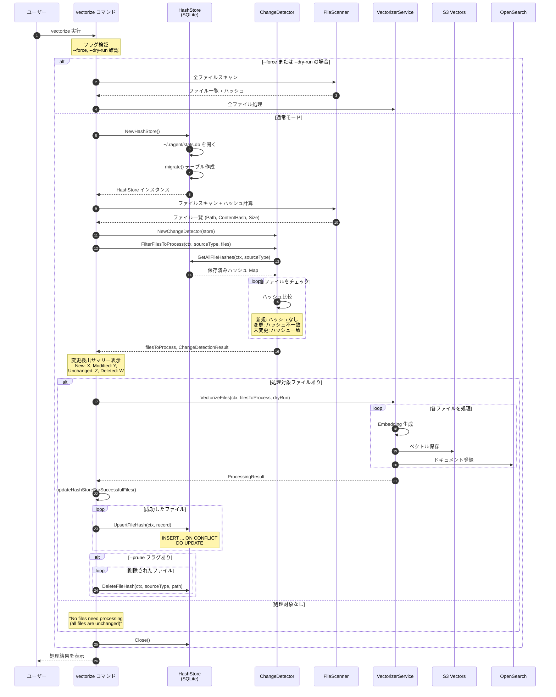

# SQLite の利用について

RAGent では SQLite を利用して、ローカルでの状態管理とメトリクス収集を行っています。

## 概要

SQLite は以下の2つの目的で使用されています:

| 用途 | パッケージ | テーブル名 | 説明 |
|------|-----------|-----------|------|
| **ファイルハッシュキャッシュ** | `internal/hashstore` | `file_hashes` | インクリメンタルベクトル化のための変更検出 |
| **メトリクス収集** | `internal/metrics` | `invocation_counts` | コマンド呼び出し回数の統計情報 |

## データベースの場所

- **パス**: `~/.ragent/stats.db`
- ディレクトリ `~/.ragent/` は初回起動時に自動作成されます
- 両方のストア (HashStore, Metrics Store) が同一のデータベースファイルを共有します

## 使用ライブラリ

```
modernc.org/sqlite v1.42.2
```

- **Pure Go 実装** (CGO 不要)
- クロスプラットフォームで動作
- 追加のネイティブライブラリのインストール不要

---

## 1. ファイルハッシュキャッシュ (HashStore)

### 目的

`vectorize` コマンドの実行時に、前回処理済みのファイルを再処理しないようにするためのキャッシュ機能です。ファイルのMD5ハッシュを保存し、変更があったファイルのみを処理対象とすることで、ベクトル化処理を高速化します。

### テーブルスキーマ

```sql
CREATE TABLE IF NOT EXISTS file_hashes (
    id INTEGER PRIMARY KEY AUTOINCREMENT,
    source_type TEXT NOT NULL,        -- "local" または "s3"
    file_path TEXT NOT NULL,          -- ファイルパス
    content_hash TEXT NOT NULL,       -- MD5ハッシュ (16進数)
    file_size INTEGER NOT NULL,       -- ファイルサイズ (bytes)
    vectorized_at DATETIME NOT NULL,  -- 最終ベクトル化日時
    UNIQUE(source_type, file_path)
);

CREATE INDEX IF NOT EXISTS idx_file_hashes_source_path 
ON file_hashes(source_type, file_path);
```

### フィールド説明

| フィールド | 型 | 説明 |
|-----------|-----|------|
| `id` | INTEGER | 自動採番の主キー |
| `source_type` | TEXT | ソースの種類 (`local`, `s3`, `mixed`) |
| `file_path` | TEXT | ファイルの絶対パスまたは S3 パス |
| `content_hash` | TEXT | ファイル内容の MD5 ハッシュ値 |
| `file_size` | INTEGER | ファイルサイズ (バイト) |
| `vectorized_at` | DATETIME | 最後にベクトル化した日時 |

### 主要な関数

| 関数 | 説明 |
|------|------|
| `NewHashStore()` | HashStore を作成 (デフォルトパス: `~/.ragent/stats.db`) |
| `NewHashStoreWithPath(dbPath)` | カスタムパスで HashStore を作成 |
| `GetFileHash(ctx, sourceType, filePath)` | 単一ファイルのハッシュレコードを取得 |
| `GetAllFileHashes(ctx, sourceType)` | 指定ソースタイプの全ハッシュを取得 |
| `UpsertFileHash(ctx, record)` | ハッシュレコードを挿入または更新 |
| `DeleteFileHash(ctx, sourceType, filePath)` | 単一ファイルのハッシュを削除 |
| `DeleteFileHashesBySourceType(ctx, sourceType)` | 指定ソースタイプの全ハッシュを削除 |
| `Close()` | データベース接続をクローズ |

### ChangeDetector

ファイル変更を検出するためのヘルパーコンポーネントです。

| 関数 | 説明 |
|------|------|
| `NewChangeDetector(store)` | HashStore から ChangeDetector を作成 |
| `DetectChanges(ctx, sourceType, files)` | 現在のファイルと保存済みハッシュを比較 |
| `FilterFilesToProcess(ctx, sourceType, files)` | 処理が必要なファイルのみをフィルタリング |

### 変更検出結果

```go
type ChangeDetectionResult struct {
    ToProcess     []FileChange // 処理対象 (新規または変更)
    Unchanged     []string     // 変更なし (スキップ)
    Deleted       []string     // 削除されたファイル
    NewCount      int          // 新規ファイル数
    ModCount      int          // 変更ファイル数
    UnchangeCount int          // 未変更ファイル数
    DeleteCount   int          // 削除ファイル数
}
```

### CLI フラグとの関係

| フラグ | HashStore への影響 |
|-------|-------------------|
| `--force`, `-f` | HashStore をバイパスし、全ファイルを再処理 |
| `--prune` | 削除されたファイルのハッシュレコードを削除 |
| `--dry-run` | HashStore の操作をスキップ |

---

## 2. メトリクスストア (Metrics Store)

### 目的

RAGent の各コマンドの呼び出し回数を日別に記録し、使用状況の統計情報を収集します。

### テーブルスキーマ

```sql
CREATE TABLE IF NOT EXISTS invocation_counts (
    mode TEXT NOT NULL,      -- 実行モード ("mcp", "slack", "query", "chat")
    date TEXT NOT NULL,      -- 日付 ("2006-01-02" 形式)
    count INTEGER DEFAULT 0, -- 呼び出し回数
    PRIMARY KEY (mode, date)
);
```

### 追跡対象のモード

```go
const (
    ModeMCP   Mode = "mcp"    // MCP サーバー経由の呼び出し
    ModeSlack Mode = "slack"  // Slack Bot 経由の呼び出し
    ModeQuery Mode = "query"  // query コマンドの実行
    ModeChat  Mode = "chat"   // chat コマンドの実行
)
```

### 主要な関数

| 関数 | 説明 |
|------|------|
| `NewStore()` | Metrics Store を作成 |
| `NewStoreWithPath(dbPath)` | カスタムパスで作成 |
| `Increment(mode)` | 指定モードの当日カウントをインクリメント |
| `GetTotalByMode(mode)` | 特定モードの累計カウントを取得 |
| `GetAllTotals()` | 全モードの累計カウントを取得 |
| `GetCountByDate(mode, date)` | 特定モード・日付のカウントを取得 |
| `Close()` | データベース接続をクローズ |

### メトリクス記録箇所

| ファイル | モード | 説明 |
|---------|--------|------|
| `cmd/chat.go:77` | `chat` | chat コマンド実行時 |
| `cmd/query.go:109` | `query` | query コマンド実行時 |
| `cmd/slack.go:34` | `slack` | Slack Bot 起動時 |
| `internal/mcpserver/hybrid_search_handler.go:50` | `mcp` | MCP hybrid search 呼び出し時 |
| `internal/mcpserver/slack_search_handler.go:43` | `mcp` | MCP slack search 呼び出し時 |

---

## vectorize における SQLite の使われ方

以下のシーケンス図は、`vectorize` コマンド実行時の SQLite (HashStore) の利用フローを示しています。



### フロー説明

#### 1. 初期化フェーズ
- `vectorize` コマンドが開始されると、まずフラグ (`--force`, `--dry-run`) を検証
- `--force` が指定されている場合は HashStore をスキップし、全ファイルを処理
- `--dry-run` の場合も HashStore の読み書きをスキップ

#### 2. HashStore 初期化
- `NewHashStore()` で `~/.ragent/stats.db` への接続を確立
- `migrate()` で `file_hashes` テーブルとインデックスを自動作成

#### 3. ファイルスキャンとハッシュ計算
- `scanLocalDirectoryWithHash()` でローカルファイルをスキャン
- 各ファイルの MD5 ハッシュを計算
- S3 ソースの場合は ETag またはダウンロード時にハッシュを計算

#### 4. 変更検出
- `ChangeDetector.FilterFilesToProcess()` が呼び出される
- `GetAllFileHashes()` で既存のハッシュレコードを全て取得
- 現在のファイルと保存済みハッシュを比較:
  - **新規**: ハッシュレコードが存在しない
  - **変更**: ハッシュ値が異なる
  - **未変更**: ハッシュ値が一致
  - **削除**: レコードは存在するがファイルがない

#### 5. ベクトル化処理
- 新規または変更されたファイルのみを `VectorizeFiles()` で処理
- 未変更ファイルはスキップ (ログに "skipped" と表示)

#### 6. ハッシュストア更新
- 処理が成功したファイルのハッシュを `UpsertFileHash()` で保存
- `--prune` フラグが指定されている場合、削除されたファイルのレコードも削除

#### 7. クリーンアップ
- `HashStore.Close()` でデータベース接続をクローズ

---

## 設計上のポイント

### 1. Pure Go SQLite
CGO を使用しない `modernc.org/sqlite` を採用しているため:
- ネイティブライブラリのインストール不要
- クロスコンパイルが容易
- Alpine Linux などでも追加設定なしで動作

### 2. 共有データベースファイル
HashStore と Metrics Store が同一の `stats.db` ファイルを使用:
- ファイル管理がシンプル
- 別々のテーブルで競合なし

### 3. Upsert パターン
`ON CONFLICT ... DO UPDATE` を使用して、挿入と更新を1つのクエリで処理:
```sql
INSERT INTO file_hashes (...)
VALUES (?, ?, ?, ?, ?)
ON CONFLICT(source_type, file_path) DO UPDATE SET
    content_hash = excluded.content_hash,
    file_size = excluded.file_size,
    vectorized_at = excluded.vectorized_at;
```

### 4. 自動マイグレーション
テーブルが存在しない場合は `CREATE TABLE IF NOT EXISTS` で自動作成。既存のデータは保持されます。
