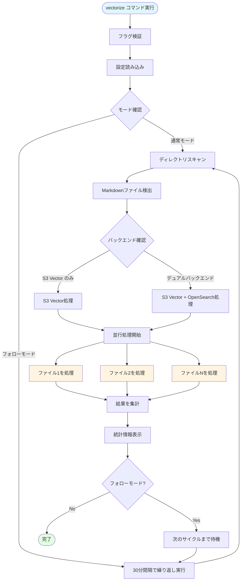
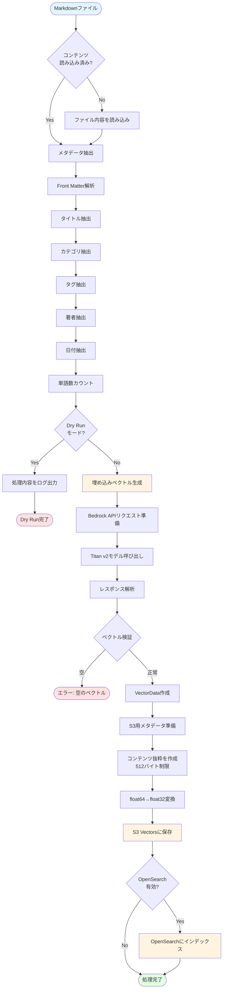
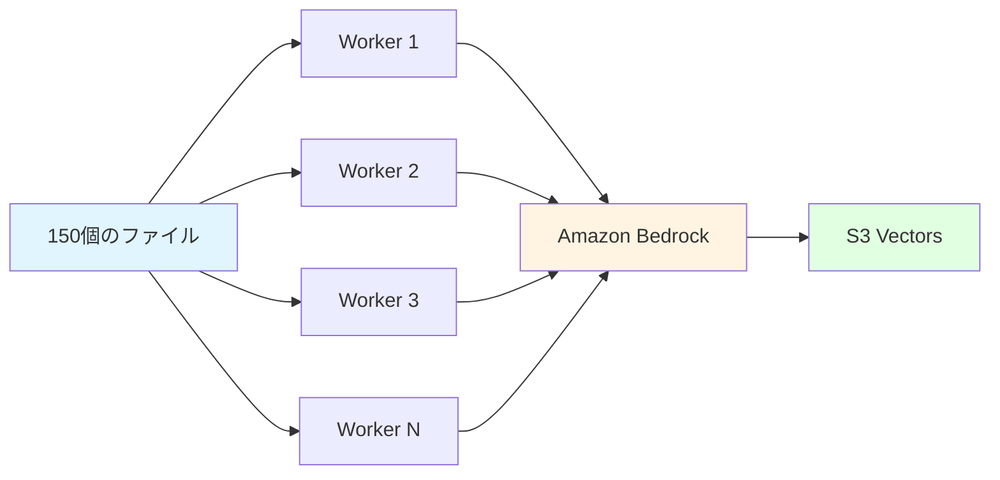
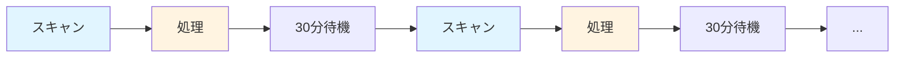

# vectorize コマンド詳細解説

## 概要

`vectorize` コマンドは、Markdownドキュメントをベクトル化し、Amazon S3 VectorsおよびOpenSearchに保存するRAGent の中核機能です。このドキュメントでは、1つのMarkdownファイルがどのように処理され、検索可能なベクトルデータに変換されるかを、RAG（Retrieval-Augmented Generation）の初学者向けに詳細に解説します。

## RAGとベクトル化の基礎

### RAGとは？

RAG（Retrieval-Augmented Generation）は、大規模言語モデル（LLM）の回答精度を向上させる技術です。LLMに質問する前に、関連する文書を検索して文脈として与えることで、より正確で具体的な回答を生成できます。

### ベクトル化とは？

ベクトル化（Embedding）は、テキストを数値の配列（ベクトル）に変換する処理です。例えば、「機械学習」というテキストは `[0.123, -0.456, 0.789, ...]` のような1024個の数値で表現されます。意味が似ているテキストは、似たようなベクトルになるため、数学的に類似度を計算できます。

### ハイブリッド検索とは？

RAGentは2つの検索手法を組み合わせています：

1. **ベクトル検索（Dense検索）**: 意味的な類似性で検索
2. **BM25検索**: キーワードマッチで検索

両方を組み合わせることで、より高精度な検索を実現します。

## 全体の処理フロー



## 1ファイルの詳細処理フロー



## 各ステップの詳細説明

### 1. ファイルスキャン (`FileScanner.ScanDirectory`)

**処理内容:**
- 指定されたディレクトリを再帰的に探索
- `.md` 拡張子のファイルを検出
- ファイル情報（パス、サイズ、更新日時）を収集

**コード例:**
```go
files, err := vs.fileScanner.ScanDirectory(directory)
// 例: markdown/tech/ai/machine-learning.md を検出
```

**出力:**
```
Found 150 markdown files to process
```

### 2. メタデータ抽出 (`MetadataExtractor.ExtractMetadata`)

**処理内容:**
- Markdownファイルの先頭にあるYAML形式のFront Matterを解析
- タイトル、カテゴリ、タグ、著者などを抽出
- 単語数をカウント

**Front Matter の例:**
```yaml
---
title: "機械学習の基礎"
category: "技術ドキュメント"
tags: ["AI", "機械学習", "Python"]
author: "山田太郎"
created_at: "2024-01-15"
---
```

**抽出されるメタデータ:**
```go
DocumentMetadata{
    Title:      "機械学習の基礎",
    Category:   "技術ドキュメント",
    Tags:       ["AI", "機械学習", "Python"],
    Author:     "山田太郎",
    FilePath:   "markdown/tech/ai/machine-learning.md",
    Source:     "machine-learning.md",
    WordCount:  1250,
    CreatedAt:  "2024-01-15T00:00:00Z",
}
```

### 3. 埋め込みベクトル生成 (`BedrockClient.GenerateEmbedding`)

**処理内容:**
- Markdownの本文全体をAmazon Bedrockに送信
- Titan Text Embedding v2 モデルを使用
- 1024次元のベクトルを生成
- コサイン類似度で検索するため正規化

**技術仕様:**
- **モデル:** `amazon.titan-embed-text-v2:0`
- **次元数:** 1024
- **正規化:** 有効（normalize: true）
- **最大入力トークン数:** 8,192トークン

**APIリクエスト例:**
```json
{
  "inputText": "# 機械学習の基礎\n\n機械学習は...",
  "dimensions": 1024,
  "normalize": true
}
```

**APIレスポンス例:**
```json
{
  "embedding": [0.0234, -0.1456, 0.0789, ..., 0.0345],
  "inputTextTokenCount": 1523
}
```

**生成されるベクトル:**
- 長さ: 1024個の浮動小数点数
- 範囲: -1.0 〜 1.0（正規化済み）
- 例: `[0.0234, -0.1456, 0.0789, ..., 0.0345]`

### 4. S3 Vectors保存 (`S3VectorService.StoreVector`)

**処理内容:**
- ベクトルとメタデータをAmazon S3 Vectorsに保存
- メタデータは2048バイト制限のため、本文は512バイトの抜粋のみ保存
- float64からfloat32に変換（S3 Vectors要件）

**保存されるデータ構造:**
```go
PutVectorsInput{
    VectorBucketName: "my-vector-bucket",
    IndexName:        "document-vectors",
    Vectors: [
        {
            Key: "tech/ai/machine-learning.md",
            Data: [float32配列: 1024次元],
            Metadata: {
                "title":           "機械学習の基礎",
                "category":        "技術ドキュメント",
                "file_path":       "markdown/tech/ai/machine-learning.md",
                "word_count":      1250,
                "content_excerpt": "機械学習は、データから...",
                "tags":            ["AI", "機械学習", "Python"],
                "author":          "山田太郎",
                "created_at":      "2024-01-15T00:00:00Z",
            }
        }
    ]
}
```

**メタデータ制限対応:**
- 合計サイズ制限: 2048バイト
- 本文抜粋: 最大512バイト（UTF-8で安全に切り詰め）
- カスタムフィールドも含めて保存

### 5. OpenSearchインデックス作成（オプション）

**処理内容:**
- デュアルバックエンドモード時に実行
- BM25検索用の転置インデックス作成
- k-NN検索用のベクトルインデックス作成
- 日本語対応（kuromojiトークナイザー）

**インデックス設定:**
```json
{
  "settings": {
    "analysis": {
      "analyzer": {
        "japanese": {
          "type": "custom",
          "tokenizer": "kuromoji_tokenizer"
        }
      }
    },
    "index.knn": true
  },
  "mappings": {
    "properties": {
      "content": {
        "type": "text",
        "analyzer": "japanese"
      },
      "embedding": {
        "type": "knn_vector",
        "dimension": 1024,
        "method": {
          "name": "hnsw",
          "engine": "faiss"
        }
      }
    }
  }
}
```

## 並行処理とエラーハンドリング

### 並行処理の仕組み

RAGentは、複数のファイルを同時に処理することで高速化を実現しています。

**並行処理フロー:**


**設定:**
- デフォルト並行数: 5
- カスタマイズ: `--concurrency` フラグで指定可能
- レート制限対応: `golang.org/x/time/rate` で制御

### エラーハンドリング

各ステップで発生しうるエラーと対処:

| エラータイプ | 原因 | 対処 |
|-------------|------|------|
| `ErrorTypeFileRead` | ファイル読み込み失敗 | ファイルパスとパーミッション確認 |
| `ErrorTypeMetadata` | メタデータ解析失敗 | Front Matter形式を確認 |
| `ErrorTypeEmbedding` | ベクトル生成失敗 | Bedrock API接続とクォータ確認 |
| `ErrorTypeS3Upload` | S3保存失敗 | AWS認証情報とバケット権限確認 |

**ログ出力例:**
```
INFO: Generating embedding for file: markdown/tech/ai/machine-learning.md
INFO: Successfully generated embedding with 1024 dimensions
INFO: Storing vector to S3 Vectors with key: tech/ai/machine-learning.md
SUCCESS: Processed 1/150 files
```

## Dry Runモード

実際にベクトル化を実行せず、処理内容を確認できます。

**使用方法:**
```bash
./RAGent vectorize --directory ./markdown --dry-run
```

**出力例:**
```
DRY RUN: Would process file markdown/tech/ai/machine-learning.md
  - Title: 機械学習の基礎
  - Category: 技術ドキュメント
  - Word count: 1250
  - Would generate 1024-dimensional embedding
  - Would store to S3 Vectors
```

## フォローモード

継続的にディレクトリを監視し、定期的にベクトル化を実行します。

**使用方法:**
```bash
# デフォルト30分間隔
./RAGent vectorize --follow

# カスタム間隔（15分）
./RAGent vectorize --follow --interval 15m
```

**動作:**


**終了方法:**
- `Ctrl+C` でグレースフルシャットダウン
- 処理中のファイルは完了してから終了

## 処理統計

処理完了後、以下の統計情報が表示されます:

```
Vectorization completed successfully!
━━━━━━━━━━━━━━━━━━━━━━━━━━━━━━━━━━━━━━━━
Processing Statistics:
  Total Files:      150
  Successful:       148
  Failed:           2
  Skipped:          0
  Processing Time:  5m 23s
  Avg Time/File:    2.16s
━━━━━━━━━━━━━━━━━━━━━━━━━━━━━━━━━━━━━━━━

Failed files:
  1. markdown/draft/incomplete.md
     Error: failed to parse front matter
  2. markdown/temp/test.md
     Error: empty embedding returned
```

## 技術仕様まとめ

### ベクトル仕様
- **モデル:** Amazon Titan Text Embedding v2
- **次元数:** 1024
- **距離メトリック:** コサイン距離
- **正規化:** 有効

### ストレージ仕様
- **S3 Vectors:**
  - メタデータ制限: 2048バイト
  - ベクトル形式: float32
  - インデックス: 自動作成

- **OpenSearch（オプション）:**
  - BM25インデックス: 日本語最適化
  - k-NNインデックス: HNSW + FAISS
  - 推奨検索件数: Dense@100 + BM25@200

### パフォーマンス
- **並行処理:** デフォルト5並行
- **スループット:** 約30ファイル/分（1000文字/ファイル）
- **Bedrockクォータ:** 1分あたり100リクエスト（東京リージョン）

## 使用例

### 基本的な使用

```bash
# 1. 初回ベクトル化
./RAGent vectorize --directory ./markdown

# 2. Dry Runで確認
./RAGent vectorize --directory ./markdown --dry-run

# 3. 並行数を調整
./RAGent vectorize --directory ./markdown --concurrency 10
```

### デュアルバックエンドモード

```bash
# S3 Vector + OpenSearch
export OPENSEARCH_ENDPOINT="https://search-xxx.ap-northeast-1.es.amazonaws.com"
./RAGent vectorize --directory ./markdown --opensearch-index documents
```

### フォローモード

```bash
# 継続的な更新監視（30分間隔）
./RAGent vectorize --follow

# カスタム間隔（15分）
./RAGent vectorize --follow --interval 15m

# バックグラウンド実行
nohup ./RAGent vectorize --follow > vectorize.log 2>&1 &
```

### ベクトルのクリア

```bash
# 既存ベクトルを全削除してから再ベクトル化
./RAGent vectorize --directory ./markdown --clear
```

**警告:** `--clear` は全ベクトルを削除します。実行前に確認プロンプトが表示されます。

## トラブルシューティング

### よくあるエラーと解決方法

**1. "failed to invoke bedrock model: AccessDeniedException"**
```bash
# AWS認証情報を確認
aws configure list

# Bedrock APIのアクセス権限を確認
aws bedrock list-foundation-models --region ap-northeast-1
```

**2. "failed to upload vector to S3 Vectors: NoSuchBucket"**
```bash
# S3バケットの存在確認
aws s3 ls s3://${S3_BUCKET_NAME}

# S3 Vectorsインデックスの確認
aws s3vectors list-vector-indexes --bucket-name ${S3_BUCKET_NAME}
```

**3. "empty embedding returned"**
- ファイルが空または短すぎる
- 最小200文字以上を推奨

**4. "metadata exceeds 2048 bytes"**
- Front Matterのカスタムフィールドが多すぎる
- 不要なフィールドを削除

## 関連コマンド

ベクトル化後の利用:

```bash
# 1. ベクトル一覧表示
./RAGent list

# 2. セマンティック検索
./RAGent query -q "機械学習のアルゴリズム" --search-mode hybrid

# 3. 対話的RAGチャット
./RAGent chat

# 4. Slack Bot起動
./RAGent slack-bot

# 5. MCP Server起動
./RAGent mcp-server
```

## まとめ

`vectorize` コマンドは、以下の処理を自動的に実行します:

1. ✅ Markdownファイルの発見とスキャン
2. ✅ Front Matterからメタデータ抽出
3. ✅ Amazon Bedrockで1024次元ベクトル生成
4. ✅ S3 Vectorsに保存（検索可能な形式）
5. ✅ OpenSearchにインデックス作成（オプション）

これにより、テキストドキュメントがセマンティック検索可能なベクトルデータベースに変換され、高精度なRAG検索が可能になります。

## 次のステップ

- [query.md](./query.md) - ハイブリッド検索の仕組み（作成予定）
- [chat.md](./chat.md) - 対話的RAGの使い方（作成予定）
- [opensearch.md](./opensearch.md) - OpenSearch統合の詳細（作成予定）
